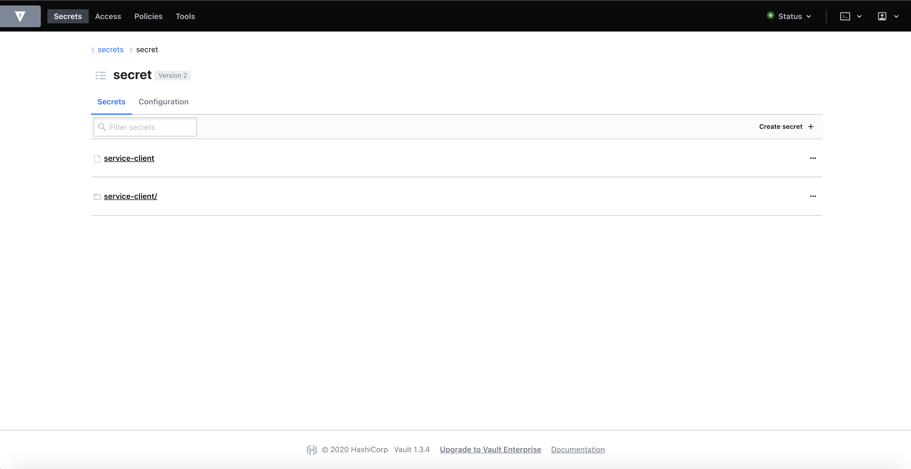
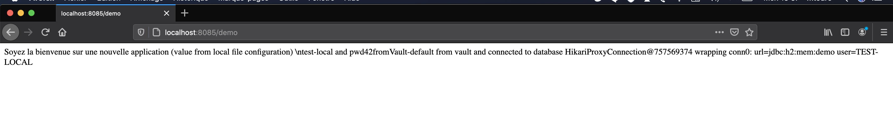
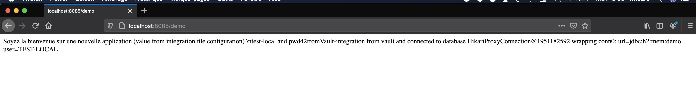

# HashiCorp Vault Demo with Spring Boot Vault 

Demo Application demonstrating values from a Hashicorp Vault instance using Spring Cloud Vault

# Vault Setup

## Local Vault Setup

*For local development testing purposes*

### Download Vault

Download from : https://www.vaultproject.io/downloads.html

### Run Vault with Docker

Open up a terminal

1. $`docker run -d -p 8200:8200 --name vault-with-spring-boot-test -e 'VAULT_DEV_ROOT_TOKEN_ID=my-root-token-id' -e 'VAULT_DEV_LISTEN_ADDRESS=0.0.0.0:8200' vault` 

- View Vault [url](http://localhost:8200) (method : token, token : my-root-token-id)

1. $`docker exec -i -t vault-with-spring-boot-test sh`
1. $`export VAULT_ADDR='http://localhost:8200'` : Note - the requirement of setting the VAULT_ADDR variable, running Vault commands needs this to know which vault instance to execute against
1. $`vault login token=my-root-token-id'`

### Add a Secret value to Vault
1. $`vault kv put secret/service-client spring.datasource.password=pwd42fromVault-default`
1. $`vault kv put secret/service-client/int spring.datasource.password=pwd42fromVault-integration`

> Note - you can access the local Vault GUI at


> Note - storage is *in-memory* , and will need to be re-populated / re-configured every time you re-start vault.

> Note - you can access the local Vault GUI at http://localhost:8200

### How to configure HashiCorp Vault in Spring Boot

I have taken the H2 database connection as an example where i am storing only password in secret vault.

To connect Vault in Springboot, we need to create bootstrap.yml under resources folder and do the vault configuration.

**_bootstrap.yml_**

```
spring:
  cloud:
    vault:
      scheme: http
      host: localhost
      port: 8200
      connection-timeout: 5000
      read-timeout: 15000
      authentication: token
      token: my-root-token-id
      kv:
        enabled: true
        application-name: service-client
      generic:
        enabled: false
```

### Start default profil 

Open up a terminal within the root of the project

1. $`cd spring-boot-vault` 
1. $`mvn clean install`
1. $`mvn spring-boot:run`



### Start integration profil 

Open up a terminal within the root of the project

1. $`cd spring-boot-vault` 
1. $`mvn clean install`
1. $`mvn spring-boot:run -Dspring-boot.run.profiles=int`




# Notes

**1. Vault Config settings are in bootstrap.properties file and not application.properties.**

**2. The setting of *spring.application.name* in the bootstrap.properties file, this value will be used when accessing the Vault Storage.**

**3. Loading of the Vault secret is performed using *Value* annotation in the *WebController* - same way as loading Values from a config server.**

**4. Spring Cloud Vault Config reads config properties from Vaults using the application name and active profiles:**

```
/secret/{application}/{profile}
/secret/{application}
/secret/{default-context}/{profile}
/secret/{default-context}
```

**5. Reloading Values from Vault**

A restart will always cause to reload of values from Vault.

For re-loading values **without** a restart, you can use the *refresh actuator* endpoint.

This will require the Actuator Spring Boot Dependency, and the refresh endpoint exposed (see application.properties file).

Also note the required addition of the RefreshScope annotation in the WebController.

To force a reload of values, the *refresh* endpoint needs to be hit:

```sh
curl -X POST http://localhost:8085/actuator/refresh
```


